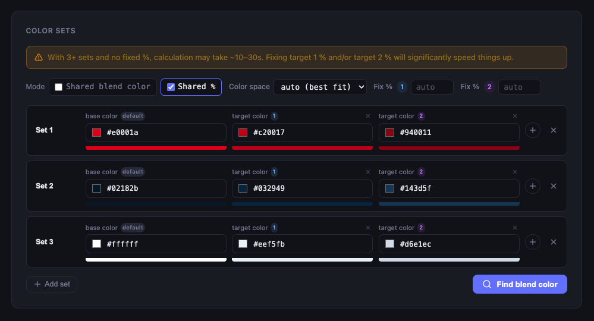
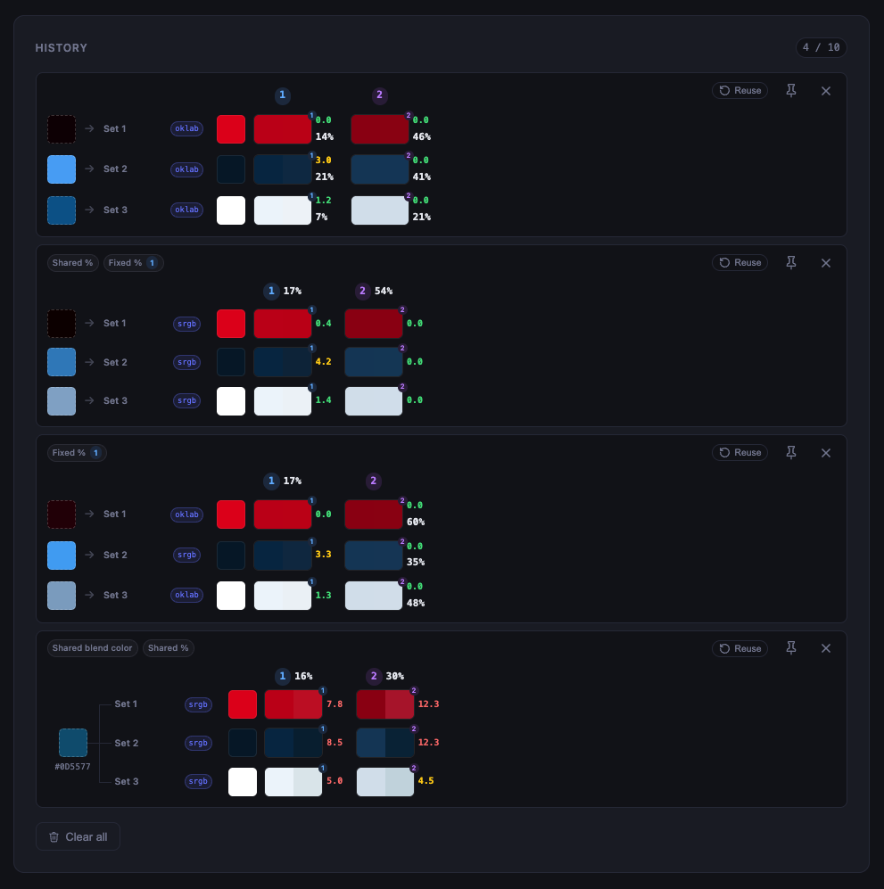

# CSS Color Mix Finder

A browser tool to find the perfect `color-mix()` blend color that reproduces your design token states (hover, active, tints, …).

## What it does

Given a **base color** and one or more **target colors** (e.g. hover, active, disabled…), the tool reverse-engineers the blend color and percentages to use in CSS `color-mix()` so the results visually match your targets as closely as possible.

```css
/* Example output */
background-color: color-mix(in oklab, #e0001a 100%, #500001 33%);
```

## Screenshots

Build your sets of colors and choose your filters


Get your blend colors and percentages


Quick access to history and pin previous results to save them


## Features

- **Multi-set support** — solve several color sets at once (e.g. primary, secondary, tertiary…)
- **1–5 target colors per set** — dynamically add / remove targets with the + button
- **Three solve modes:**
  - _Shared blend color_ — one blend color + shared percentages for all sets
  - _Per-set blend, shared %_ — each set gets its own blend color, percentages are shared
  - _Independent per set_ — fully independent blend color and percentages per set
- Supports **oklab**, **lab**, and **sRGB** color spaces — or let it pick the best fit automatically
- **Fix %** — lock any target percentage to a specific value, or leave it auto-optimized
- Shows **Delta E** perceptual color difference between result and target (color-coded)
- Side-by-side result vs target swatches — **click any swatch to copy** its hex value
- Displays live `color-mix()` CSS snippets with one-click copy
- **Figma paste support** — paste a hex value directly from Figma
- **History** — last 10 calculations persisted in localStorage, with summary badges
- **Pin** history entries to protect them from being evicted
- Light / dark mode toggle
- Solver runs in a **Web Worker** — UI stays responsive during long calculations

## Usage

```bash
npm install
npm start   # opens http://127.0.0.1:8080
```

> **`npm start` is required** — do not open `index.html` directly as a `file://` URL.
> The solver runs in a [Web Worker](src/js/solver-worker.js) which uses `importScripts`.
> This only works over HTTP, not from the filesystem.

No build step — vanilla HTML/CSS/JS served by live-server.

## Tests

```bash
npm test
```

Note: the test suite (`tests/`) currently uses ES module `import` syntax while the source files are plain browser globals. Tests will fail to run until the test files are updated to match. The source files themselves are correct and tested manually in the browser.

## License

MIT
