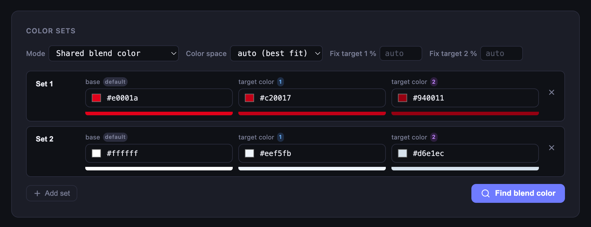
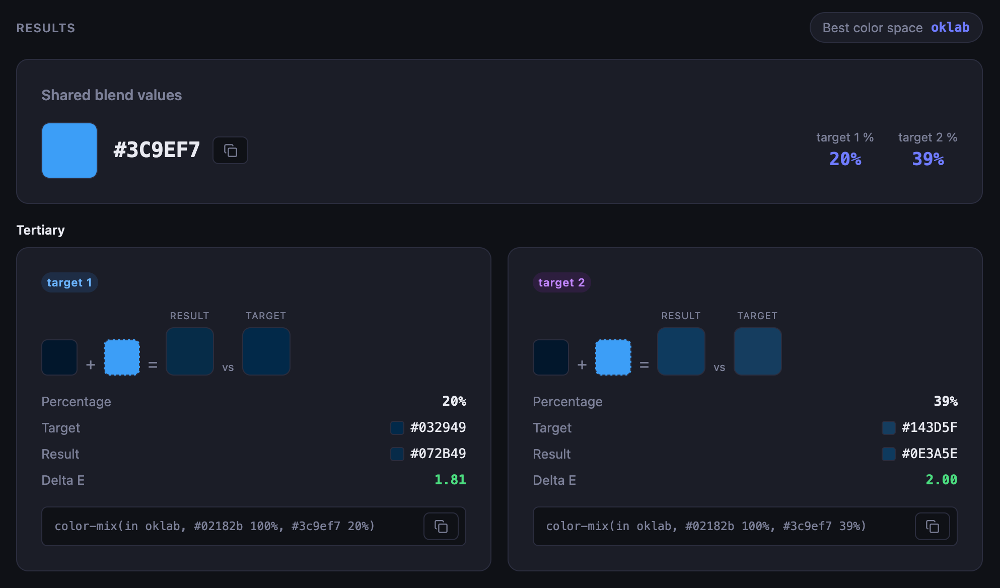
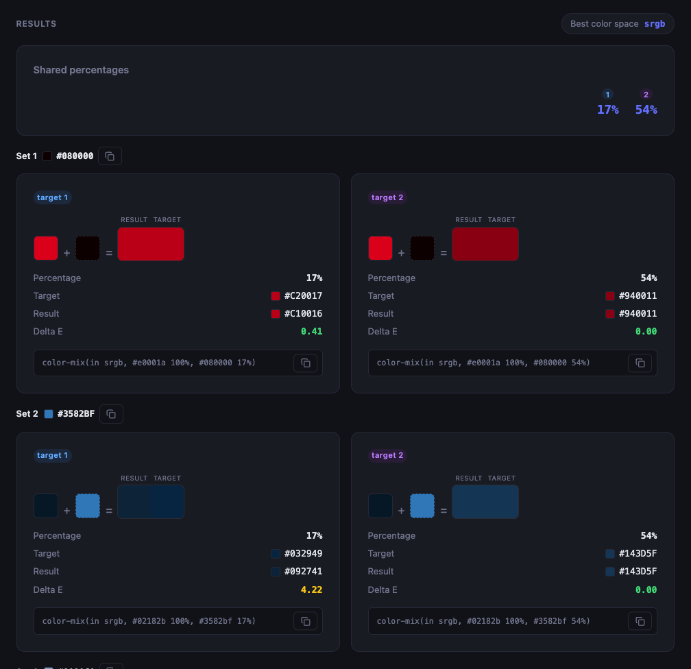
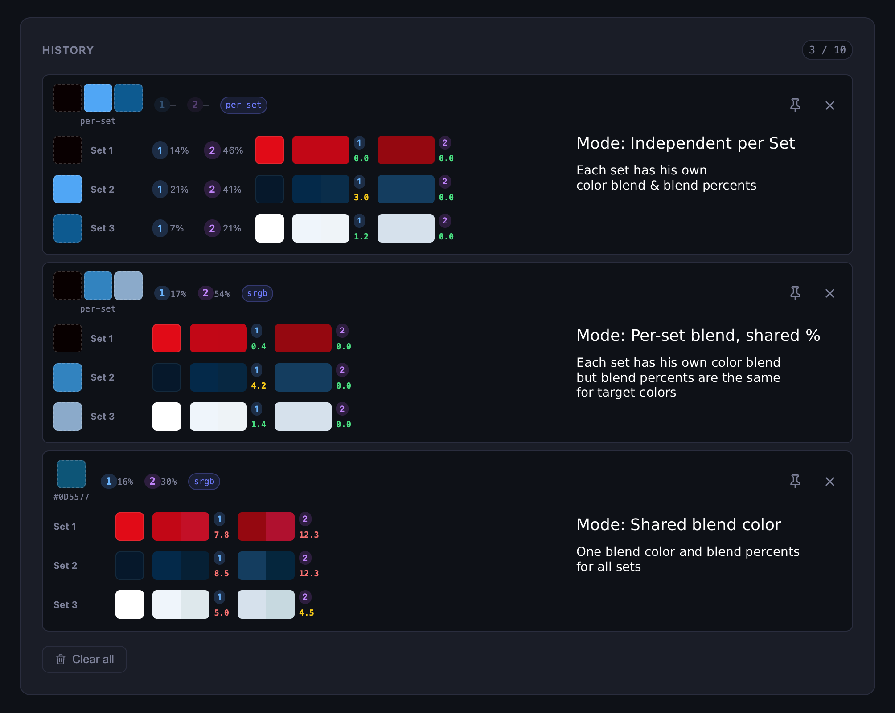

# CSS Color Mix Finder

A browser tool to find the perfect `color-mix()` blend color that reproduces your design token states (hover, active, tints, …).



## What it does

Given a **base color** and two **target colors** (e.g. hover and active states), the tool reverse-engineers the blend color and percentages to use in `color-mix()` so the results visually match your targets as closely as possible.

```css
/* Example output */
background-color: color-mix(in oklab, #e0001a 100%, #500001 33%);
```

## Features

- **Multi-set support** — solve several color sets at once (e.g. primary, secondary, tertiary…)
- **Three solve modes:**
  - *Shared blend color* — one blend color + shared percentages for all sets
  - *Per-set blend, shared %* — each set gets its own blend color, percentages are shared
  - *Independent per set* — fully independent blend color and percentages per set




- Supports **oklab**, **lab**, and **sRGB** color spaces — or let it pick the best fit automatically
- Fix one or both target percentages to constrain and speed up the search
- Shows **Delta E** perceptual color difference between result and target
- Displays live `color-mix()` CSS snippets with one-click copy
- **History** — last 10 calculations persisted in localStorage, restored on click
- **Pin** history entries to protect them from being evicted
- Light / dark mode toggle
- Solver runs in a **Web Worker** — UI stays responsive during long calculations



## Usage

```bash
npm install
npm start   # opens http://127.0.0.1:8080
```

> **`npm start` is required** — do not open `index.html` directly as a `file://` URL.
> The solver runs in a [Web Worker](src/js/solver-worker.js) which uses `importScripts`.
> This only works over HTTP, not from the filesystem.

No build step — vanilla HTML/CSS/JS served by live-server.

## Tests

```bash
npm test
```

Note: the test suite (`tests/`) currently uses ES module `import` syntax while the source files are plain browser globals. Tests will fail to run until the test files are updated to match. The source files themselves are correct and tested manually in the browser.

## License

MIT


